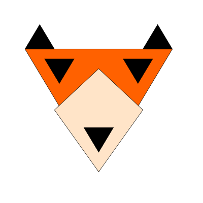

<p align="center"></p>

# fux
Fux is a user interface library with uni-directional dataflow.

## Install
### NPM
```shell
npm install --save-dev fux
```
### Starter Project


## Usage
```javascript
import { h, views, scopes, decorators, helper } from 'fux';

const { component, controller } = decorators;
const btnController = { inc: helper.patch('/count', v => v + 1) };

const App = component(
  controller(btnController)
)(function({ context, dispatch }) {
  return (<div>
    <input type='button' onClick={dispatch('inc')}/>
    {context.get('/count')}
  </div>);
});

const view = views.dom(document.body, App);
const scope = scopes.value({ count: 0 });

helper.cycle(view, scope);
```

## Architecture


- Context
  - immutable data structure (struct)
  - holds application context
  - emitted from scopes, when they have new data
  - consumed from views
- PatchSet
  - list of [json patch](http://jsonpatch.com/) objects
  - used like actions in flux architecture
  - used to manipulate Context
  - emitted from views, when they change state
  - consumed from scopes
- Scope
  - state container
  - representation of data that may change over time (stream)
- View
  - passes context to [deku component](http://dekujs.github.io/deku/)
  - render component to DOM
  - component may dispatch PatchSet on user interaction
- Component
  - stateless
  - dispatches side effects to scopes
  - additional functionality added through decorators

## Hack
```shell
git clone https://github.com/freemountain/fux
cd fux
npm install
npm run dev
```
... and click [here](http://localhost:4567/)

## License
The MIT License (MIT)
